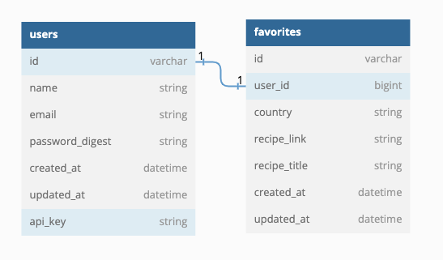

## Lunch and Learn

## Table of contents

- [Schema](#Schema)
- [Setup](#Setup)
- [Endpoints](#endpoints)
- [Contributors](#contributors)

## Schema: 

<!--  -->

## Setup

- `Ruby 2.7.4`
- `Rails 5.2.8.1'`
- [Fork this repository](https://github.com/mullinsand/lunch-and-learn)
- Clone your fork
- From the command line, install gems and set up your DB:
- `bundle install`
- `rails db:{create,migrate,seed}`
- run the server with 'rails s'
- Go to Postman and use one of these endpoints. The endpoints must look something like: http://localhost:3000/api/v1/recipes
<!-- - Alternatively you can download the Postman Suite and run the [premade endpoints](./app/assets/files/lunch-and-learn.postman_collection.json) -->

# Endpoints